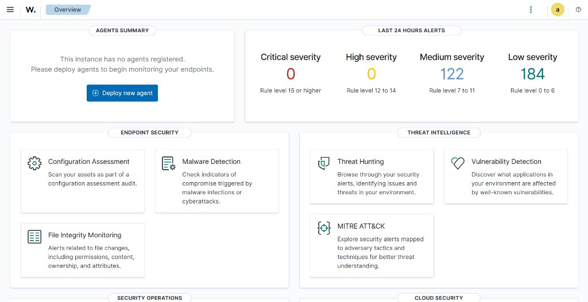
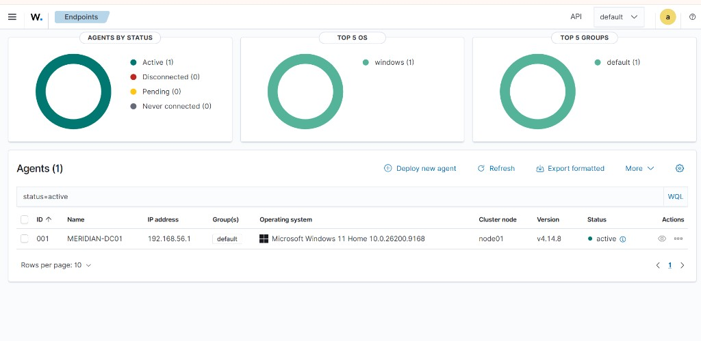
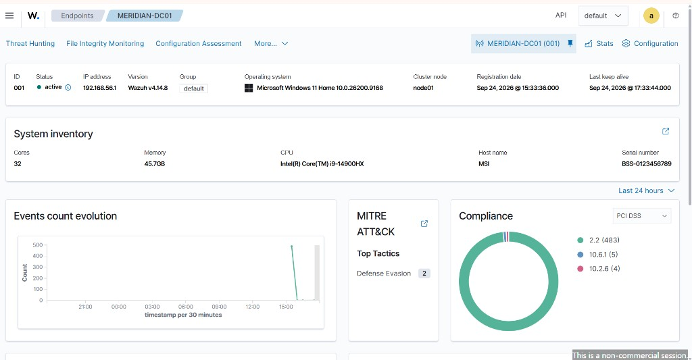
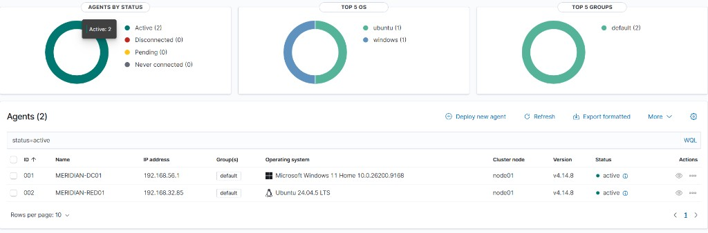
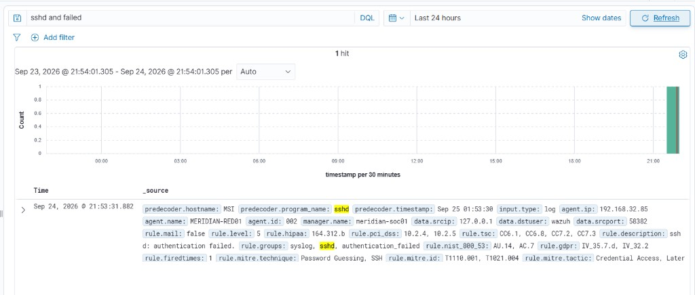
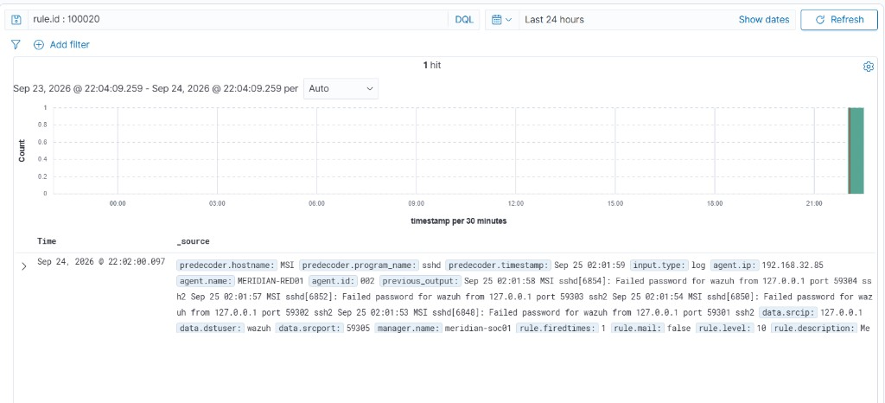
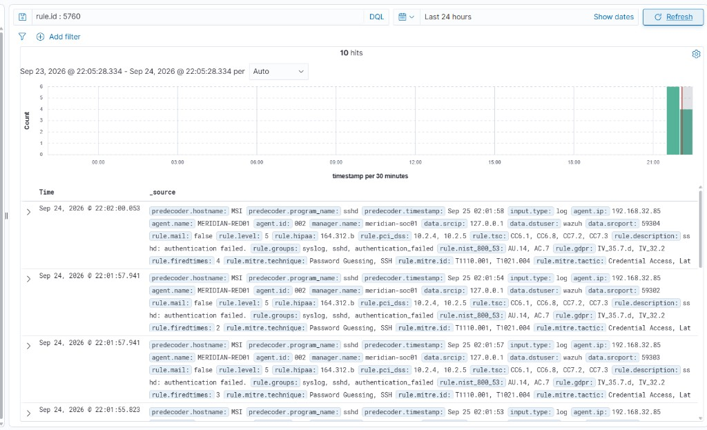
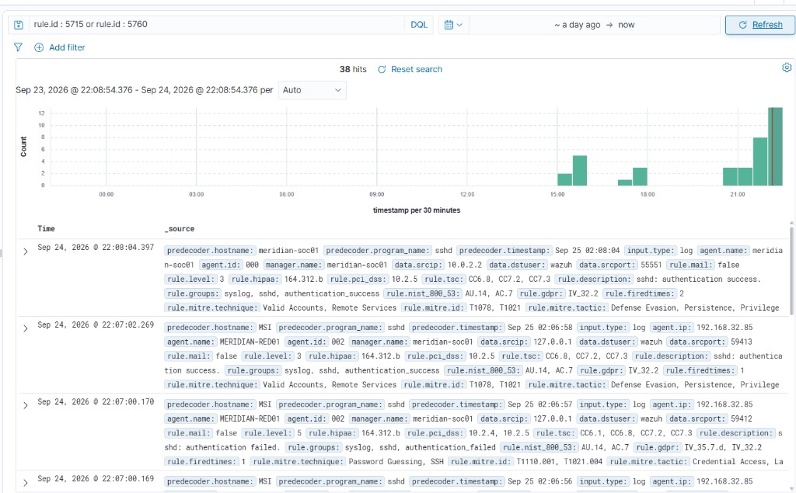
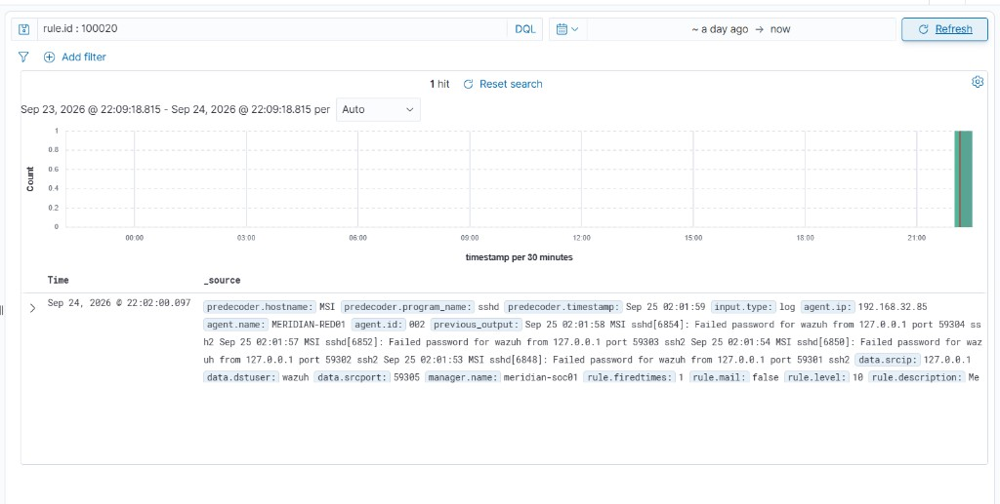

# Meridian Wazuh SOC

This repository is a single-node Wazuh SIEM project for **Meridian Health Network**: two agents, custom detection rules, alert triage, and a tuned SSH rule with a Tier 1 playbook.

---

## What this project does

It stands up a Security Operations Center (SOC) stack using **Wazuh 4.14** as the Security Information and Event Management (SIEM) system.

The work is detection engineering, not application development:

1. Collect endpoint telemetry (Windows + Linux).
2. Normalize and index it on one manager.
3. Write custom rules that turn raw events into analyst-facing alerts.
4. Triage overnight alerts as true positive (TP) or false positive (FP).
5. Tune the noisy SSH rule so a known retry-then-success pattern does not waste Tier 1 time, while a no-success burst still pages.

## Why

Meridian needs failed logins, Kerberos ticket abuse, and other credential-access behavior to become visible in minutes. A small clinic cannot run a three-tier SIEM cluster. One Ubuntu host with manager, indexer, and dashboard is enough for about 100 agents and 90 days of alerts.

The loop is the same one a real SOC uses:

- deploy collection
- prove telemetry arrived (raw fields in Discover)
- write event-match and behavior-match rules
- measure Mean Time to Detect (MTTD)
- tune for alert fatigue without dropping the attack class

No production, campus, or employer host is used.

---

## Architecture

| Host | Role | Notes |
|---|---|---|
| **MERIDIAN-SOC01** | Wazuh manager, indexer, dashboard | Ubuntu, `192.168.56.30` |
| **MERIDIAN-DC01** | Windows agent | Domain-controller fallback: the Windows lab host |
| **MERIDIAN-RED01** | Linux agent | Ubuntu |

Local dashboard (lab VM only): `https://127.0.0.1:8443`

**Live-fire path:** Path 2 (SSH authentication failures on RED01). Path 1 (Kerberoasting / Windows 4769 RC4 TGS) is written into the rules for triage alignment, but it was not the live fire path because a working domain controller was not required.

Wazuh 4.14 journald collection classifies `Failed password` lines as built-in rule **5760** (not classic-syslog 5716). Custom rule 100020 is chained from 5760. The frequency logic is the same.

---

## Custom rules

| ID | Type | Meaning |
|---|---|---|
| **100010** | Event match | One Kerberos TGS (4769) using RC4 (`0x17`) — T1558.003 |
| **100011** | Behavior match | Eight 100010 hits from the same source in 300 seconds |
| **100020** | Behavior match | Five SSH auth failures (parent 5760) from the same source in 120 seconds — T1110.001 |

The Challenge tune adds `<same_field>dstuser</same_field>` so a same-IP spray across many usernames is not treated as one account retry. The VPN/job false positive is still one username, so XML alone cannot suppress it. The **Tier 1 SOP** closes a 100020 if the same source and account get a successful SSH (rule 5715) within 120 seconds.

### Alert triage (summary)

| # | TP/FP | ATT&CK | Disposition |
|---|---|---|---|
| 1 | TP | T1558.003 | Escalate (roast burst) |
| 2 | TP | T1110.003 | Escalate (root brute, then success) |
| 3 | TP | T1110.003 | Escalate (password spray) |
| 4 | FP | none | Close / tune 100010 (legacy print SPN) |
| 5 | FP | none | Close / tune 100020 (job retry then success) |
| 6 | TP | T1558.003 | Escalate urgent (admin host, many SPNs) |
| 7 | FP | none | Close / tune 5720 (no SSH listener) |
| 8 | FP | none | Close (spaced ETL tickets, no 100011) |

MTTD on the same 100011 rule: alert #1 = **4.67 min**, alert #6 = **3.00 min**. The clock starts at the first matching event and the alert is stamped when the frequency threshold is crossed.

---

## What we achieved

- Wazuh 4.14 all-in-one running on MERIDIAN-SOC01.
- Two agents **Active**: MERIDIAN-DC01 (Windows) and MERIDIAN-RED01 (Linux).
- Raw SSH failure telemetry in Discover (source IP and username).
- Custom rule **100020** fired at level 10 with MITRE T1110.001.
- Supporting 5760 events from the same source and username.
- Tuned rule plus SOP: retry-then-success is a close, not an escalate.
- The original no-success burst still raises 100020.

Dashboard captures are below. Each image is a live manager or Discover view from this build.

---

## Evidence walkthrough

### 1. Empty SIEM baseline

After first admin login, no agents are registered. This is the “before” picture: collection, parse, and dashboards exist, but nothing is shipping events yet.



### 2. Windows agent Active

MERIDIAN-DC01 checks in to `192.168.56.30`. Active status and last keep-alive prove the Windows side of the SOC is online.





### 3. Both agents Active

MERIDIAN-DC01 (Windows) and MERIDIAN-RED01 (Linux) are both Active. That is the minimum two-host telemetry plane for Meridian.



### 4. Raw SSH failure (not a custom rule yet)

Discover shows one `sshd` authentication failure on RED01: user `wazuh`, source `127.0.0.1`. This is built-in rule **5760** (T1110). Custom 100020 has not fired yet; this only proves the agent is reading SSH telemetry.



### 5. Custom rule 100020 fires

Five failures from the same source inside 120 seconds trip **100020** at level 10. `previous_output` lists the Failed password lines. This is the behavior match (burst), not a single fat-finger.



### 6. Supporting events under the fire

The same window in Discover as **5760** rows: same agent, same source IP, same username. An analyst can reconstruct why 100020 counted to five.



### 7. Tuned path: retry then success (SOP close)

After the tune (`same_field` dstuser) plus the playbook: two 5760 failures, then **5715** success for the same user and IP. That is a VPN/job retry class. Do **not** escalate.



### 8. No-success burst still pages

The earlier 100020 fire has no following 5715. Five Failed password lines, same source, level 10. The tune did not blind the SOC to a burst with no login success.



---

## How to use this project

This is **configuration and detection content**, not a mobile or web app. You need your own lab Wazuh manager. Do not point these files at a production or campus SIEM.

### 1. Deploy the final rules (Challenge-tuned)

On the Wazuh manager, as root:

```bash
# backup
cp -a /var/ossec/etc/rules/local_rules.xml /var/ossec/etc/rules/local_rules.xml.bak

# copy this repo file
cp submission/local_rules.xml /var/ossec/etc/rules/local_rules.xml
chown root:wazuh /var/ossec/etc/rules/local_rules.xml
chmod 660 /var/ossec/etc/rules/local_rules.xml

# syntax check, then restart
/var/ossec/bin/wazuh-analysisd -t
systemctl restart wazuh-manager
systemctl is-active wazuh-manager
```

- `submission/local_rules.xml` — **final** tuned 100020 (`same_source_ip` + `same_field` dstuser).
- `submission/local_rules_partD.xml` — earlier version (same source IP only), if you want to replay the pre-tune fire.
- `linux/soc01/local_rules.xml` — copy taken from the live manager after the tune.

### 2. Apply the playbook

Read [`submission/Tier1_SOP_100020.txt`](submission/Tier1_SOP_100020.txt).

On every 100020 alert, search the next 120 seconds for rule **5715** (SSH success) for the same source IP and username. Close if that success is a known staff or service account. Escalate if there is no success, or the account is unused / root / unknown.

### 3. Reference configs (do not overwrite blindly)

| File | Use |
|---|---|
| `linux/soc01/ossec.conf` | Sanitized manager config from this lab |
| `linux/red01/ossec.conf` | Sanitized Linux agent config (`WAZUH_MANAGER=192.168.56.30`, name `MERIDIAN-RED01`) |
| `linux/soc01/opensearch_dashboards.yml` | Dashboard timeout / session settings used here |
| `linux/soc01/agents.txt` | Agent list at export time |

Agent keys, `authd.pass`, and dashboard passwords are **not** in this repository. Use the password file created by the official Wazuh installer on your own VM.

### 4. Official installer (high level)

Wazuh documents the all-in-one install. On a dedicated Ubuntu lab VM (not this checkout):

```text
https://documentation.wazuh.com/current/installation-guide/index.html
```

Then install agents with `WAZUH_MANAGER=<manager-ip>` and register them. This repository does not include the installer or any attack tooling.

### 5. Discover searches used here (DQL)

```
rule.id : 5760
rule.id : 100020
rule.id : 5715 or rule.id : 5760
```

Use spaces around `:` when the search language is DQL.

---

## Limitations

- **Single node.** Manager, indexer, and dashboard share one VM. If that host dies, collection and search history both stop.
- **No live Kerberoasting path.** 100010 / 100011 are deployed for triage. They were not proven with a live 4769 / 0x17 fire in this build.
- **Journald vs classic syslog.** Parent SID is 5760 here. A classic-syslog lab that only fires 5716 needs `<if_matched_sid>5716</if_matched_sid>` or a group match.
- **SOP is human, not XML.** Wazuh cannot cleanly express “not followed by success.” VPN retry suppression depends on analysts following the playbook.
- **Same-account tune is incomplete alone.** `dstuser` still matches the VPN false-positive class (one user, many retries). Raising frequency would miss the five-failure burst.
- **Lab network only.** Host-only / NAT addresses (`192.168.56.30`, `10.0.2.15`) are not reachable from the internet. This is not a hosted Wazuh Cloud or Firebase app.
- **Windows agent fallback.** DC01 is a workstation-class Windows host, not a real clinic domain controller. CIS/SCA scores on that host are not part of this project’s evidence.

---

## Future work

- Prove Path 1 when a domain controller is available: one 4769 with `TicketEncryptionType` 0x17, then a burst that fires 100011.
- Keep a replay set (one retry-then-success fixture, one no-success burst) and re-run it after any VPN or jump-host change.
- Watch 100020 volume for two weeks before calling the tune stable.
- Split indexer and dashboard off the manager if Meridian grows past a single-node profile.
- Add a detection for password spray (many usernames, one source) as its own rule, separate from 100020.
- Store rules in git and promote them with a checked `wazuh-analysisd -t` step so a bad XML cannot take the manager down.

---

## Repository layout

```text
submission/
  Evidence1_…Evidence8_*.png     Dashboard captures (embedded in this README)
  Evidence2_DC01_Detail.png      Extra DC01 keep-alive view
  local_rules.xml                Final tuned rules
  local_rules_partD.xml          Pre-tune 100020
  Tier1_SOP_100020.txt           Close-if-success playbook
linux/soc01/                     Live manager export (sanitized)
linux/red01/                     Live Linux agent export (sanitized)
```

**Never committed:** report PDFs, `client.keys`, `authd.pass`, `wazuh-passwords.txt`, dashboard admin passwords.

---

## Use

Lab SIEM artifacts for Meridian. Not a production SIEM. Do not reuse the rules against systems you do not own or administer.
