# IA 642 Week 04 — Meridian Health Network Labs

**Course:** IA 642 Defensive Security · Eastern Michigan University  
**Student:** Unais Ali  
**Repository:** [github.com/unaisshazan/ia642-week04-meridian-soc](https://github.com/unaisshazan/ia642-week04-meridian-soc)

| Folder | Lab | Topic |
|--------|-----|--------|
| [`4.1/`](./4.1/) | Module 01 | Kerberoasting → gMSA → OAuth2/PKCE → AES-only Kerberos |
| [`4.2/`](./4.2/) | Module 02 | Wazuh SIEM agents, custom rules, SSH Tier-1 SOP |

Submit PDFs:

- `4.1/submission/Ali_Week04_Module01_Lab.pdf`
- `4.2/submission/Ali_Week04_Module02_Lab.pdf`

---

## Repository layout

```text
ia642-week04-meridian-soc/
├── README.md                 ← this A–Z guide
├── 4.1/
│   ├── docs/                 cheatsheet
│   ├── scripts/              DC bring-up, PKCE curl, capture helpers
│   └── submission/
│       ├── Ali_Week04_Module01_Lab.pdf|.tex
│       └── evidence/         figures + command captures
└── 4.2/
    ├── linux/                soc01 + red01 Wazuh configs / status dumps
    └── submission/           Module 02 PDF, evidence PNGs, local_rules, SOP
```

---

# Lab 4.1 — A to Z project guide

**Goal:** Build disposable AD domain `meridian.local`, prove Kerberoasting (T1558.003) against a weak SQL service account, remediate with a **gMSA**, complete **OAuth2 Authorization Code + PKCE** on Keycloak, then harden Kerberos to **AES-only**.

### Lab topology

| Host | Role | IP |
|------|------|-----|
| MERIDIAN-DC01 | Windows Server AD DS + DNS | `10.77.0.10` |
| MERIDIAN-RED01 | Ubuntu attacker / Keycloak | `10.77.0.20` |
| Hypervisor net | VirtualBox `intnet` | `meridian-lab-net` |

### A → Z walkthrough

1. **A — Attach VMs** to isolated `meridian-lab-net` (no production routing).
2. **B — Address DC / RED** — DC `10.77.0.10/24`, RED `10.77.0.20/24`.
3. **C — Promote DC** — `Install-ADDSForest` → domain `meridian.local`.
4. **D — Create OUs** — Service Accounts, Clinical Staff.
5. **E — Weak SPN account** — `svc-billingsql` / `Summer2019!` with  
   `MSSQLSvc/billing.meridian.local:1433` and `MSSQLSvc/billing:1433`.
6. **F — Ordinary user** — `j.reyes` (non-admin) for roast + OIDC.
7. **G — Evidence #1** — `setspn -L svc-billingsql`.
8. **H — Evidence #2** — `klist get` / `klist` as `j.reyes` (TGS issued).
9. **I — Kerberoast** — Impacket `GetUserSPNs.py … -request` → `$krb5tgs$23$`.
10. **J — Crack** — `hashcat -m 13100` → plaintext `Summer2019!` (**Evidence #3–#4**).
11. **K — Critical thinking** — why SPN TGS is not privileged; ATT&CK; lockout useless offline; 4769 telemetry.
12. **L — gMSA remediate** — `gmsa-billingsql$`, interval 30 days, move SPNs, disable human account (**Evidence #5**).
13. **M — Re-roast gMSA** — AES `$krb5tgs$18$`; wordlist does **not** yield a human password (**Evidence #6**).
14. **N — Keycloak 26** — Docker on RED01, realm `meridian`, public client `meridian-billing-app`, PKCE S256.
15. **O — Auth code + PKCE** — use `curl` cookie jar (`scripts/pkce_curl.sh`); Python `urllib` drops `AUTH_SESSION_ID` (“Cookie not found”).
16. **P — Evidence #7–#8** — `access_token` / `refresh_token` / `id_token`; decode JWT `alg=RS256`.
17. **Q — AES-only** — `msDS-SupportedEncryptionTypes = 0x18` → fresh TGS etype 18 (**Evidence #9**).
18. **R — Report** — rebuild `Ali_Week04_Module01_Lab.pdf` (repo link on cover).

### Important scripts (4.1)

| Path | Purpose |
|------|---------|
| `4.1/scripts/configure-dc01.ps1` | Post-install DC / forest helpers |
| `4.1/scripts/pkce_curl.sh` | Full Authorization Code + PKCE capture |
| `4.1/scripts/capture_pkce_curl.py` | Host-side runner (SSH → RED01) |
| `4.1/scripts/capture_ev2_only.py` | Guestcontrol `klist` as `j.reyes` |
| `4.1/docs/LAB41_CHEATSHEET.md` | Command cheatsheet |

### Lab 4.1 evidence gallery

#### Part A — connectivity

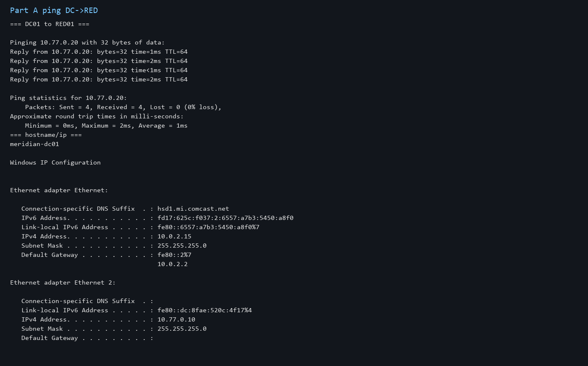

#### Evidence #1 — SPNs on svc-billingsql

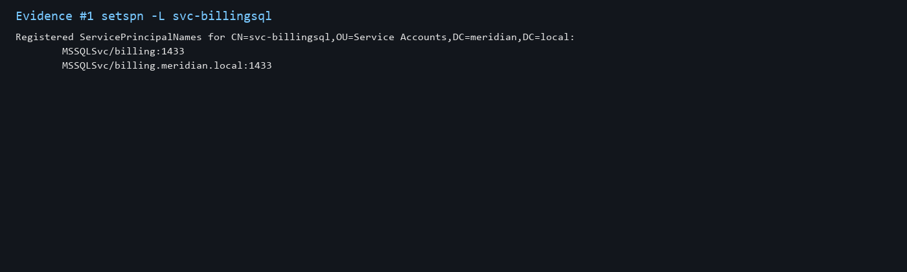

#### Evidence #2 — klist as j.reyes

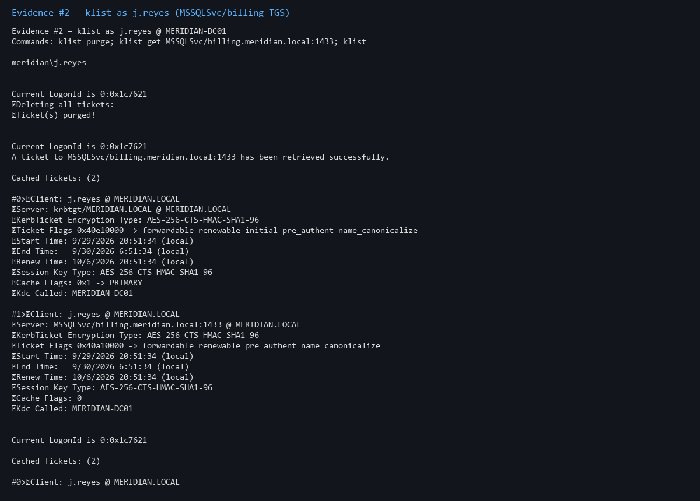

#### Evidence #3 — GetUserSPNs RC4 hash

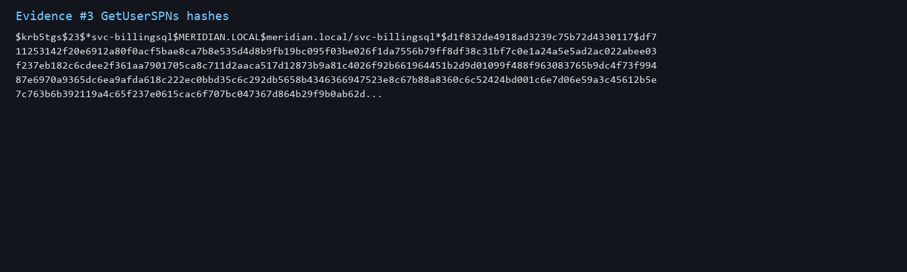

#### Evidence #4 — hashcat cracked Summer2019!

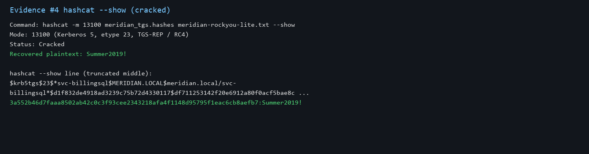

#### Evidence #5 — gMSA Test-ADServiceAccount

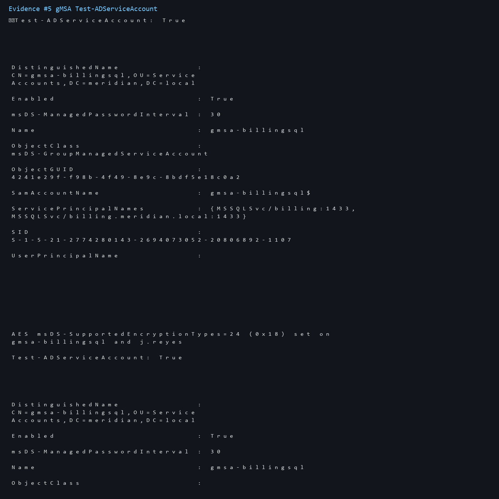

#### Evidence #6 — gMSA AES roast / no human crack

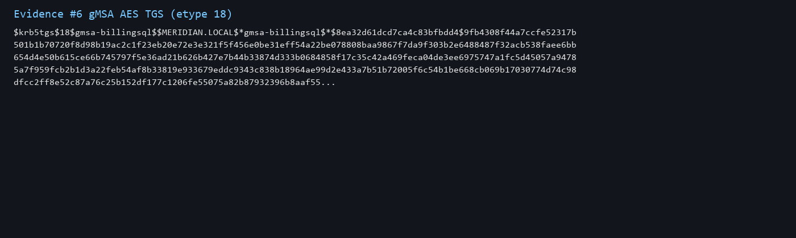

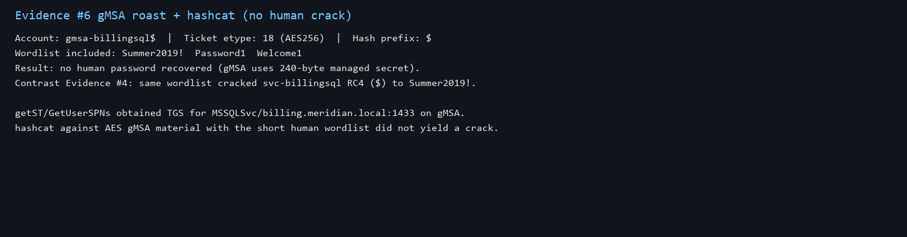

#### Evidence #7 — PKCE token_response

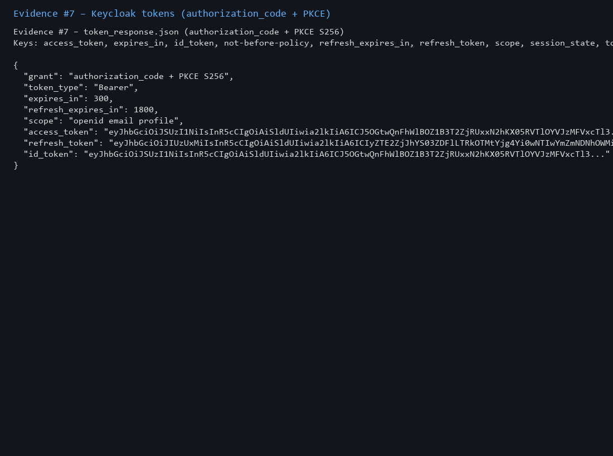

#### Evidence #8 — JWT header + payload

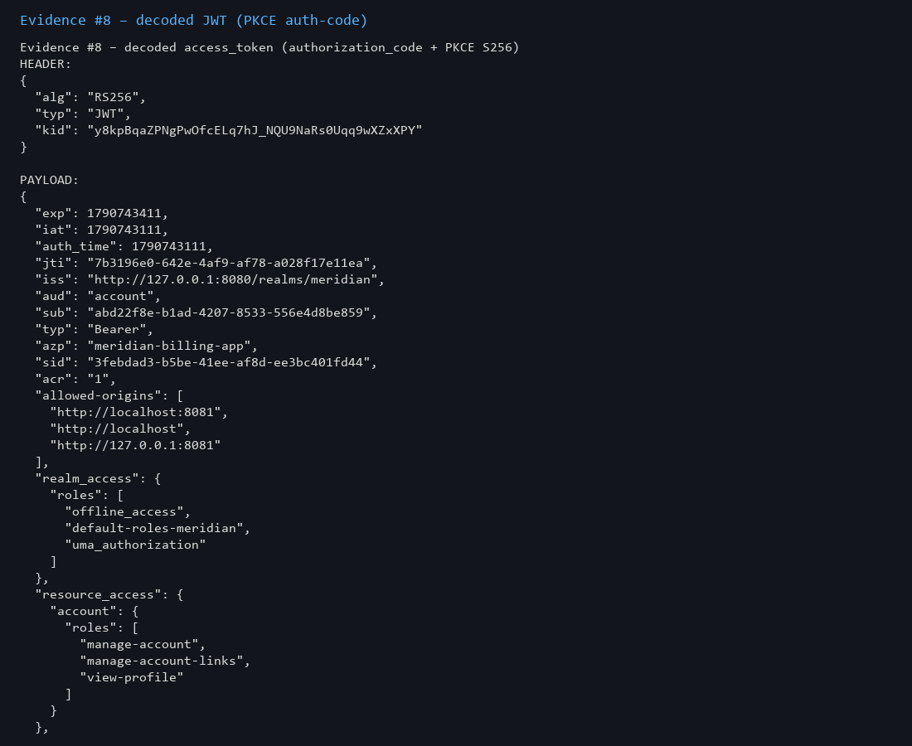

#### Evidence #9 — AES-only TGS ($18$)

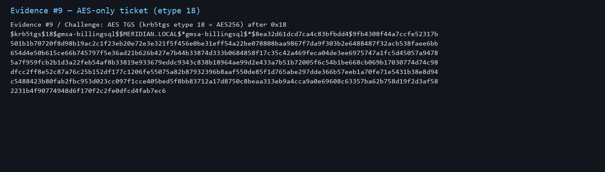

---

# Lab 4.2 — A to Z project guide

**Goal:** Deploy / operate **Wazuh** for Meridian SOC: enroll agents, author custom detection rules, and document a Tier-1 SSH playbook.

### A → Z walkthrough

1. **A — Bring up SOC manager** (`soc01`) and confirm Wazuh manager / dashboard services.
2. **B — Enroll DC01 Windows agent** — verify agent listed and active.
3. **C — Enroll RED01 Linux agent** — both agents healthy in overview.
4. **D — Generate SSH failures** on RED01 (failed password attempts).
5. **E — Confirm builtin rule 5760** (SSHD authentication failed) fires.
6. **F — Author custom rule 100020** in `local_rules.xml` (burst / sequence logic for lab).
7. **G — Restart analysisd / manager** so rules load.
8. **H — Replay SSH burst** — confirm **100020** alerts.
9. **I — Document Tier-1 SOP** — triage steps for analysts (`Tier1_SOP_100020.txt`).
10. **J — Package evidence screenshots** Evidence1–Evidence8 + PDF report.

### Important files (4.2)

| Path | Purpose |
|------|---------|
| `4.2/submission/local_rules.xml` | Custom detection rules (incl. 100020) |
| `4.2/submission/local_rules_partD.xml` | Part D rule variant |
| `4.2/submission/Tier1_SOP_100020.txt` | Tier-1 analyst SOP |
| `4.2/linux/soc01/ossec.conf` | Manager config snapshot |
| `4.2/linux/soc01/local_rules.xml` | Live rules from soc01 |
| `4.2/linux/red01/ossec.conf` | Agent config snapshot |

### Lab 4.2 evidence gallery

#### Evidence 1 — Wazuh overview

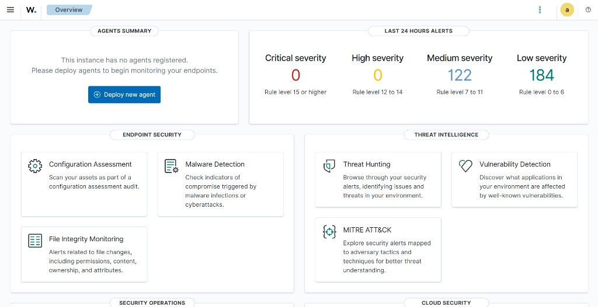

#### Evidence 2 — DC01 agent

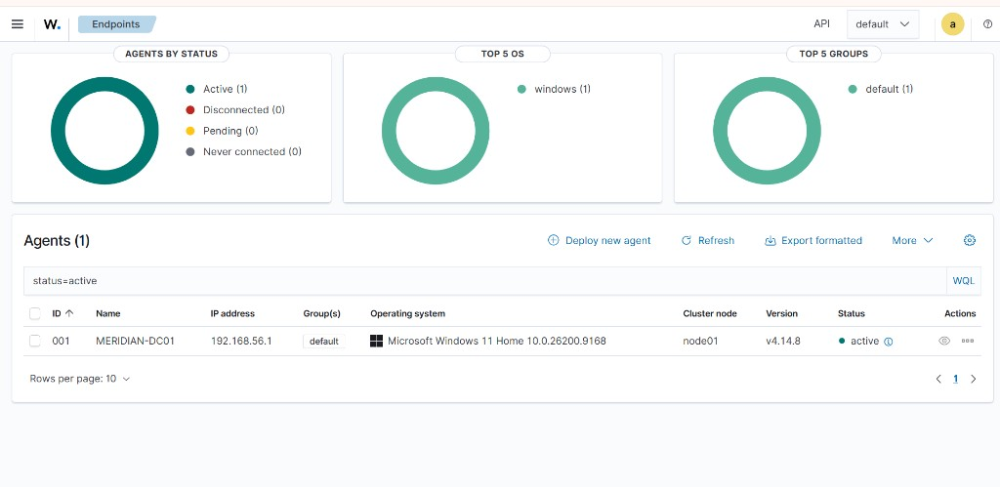

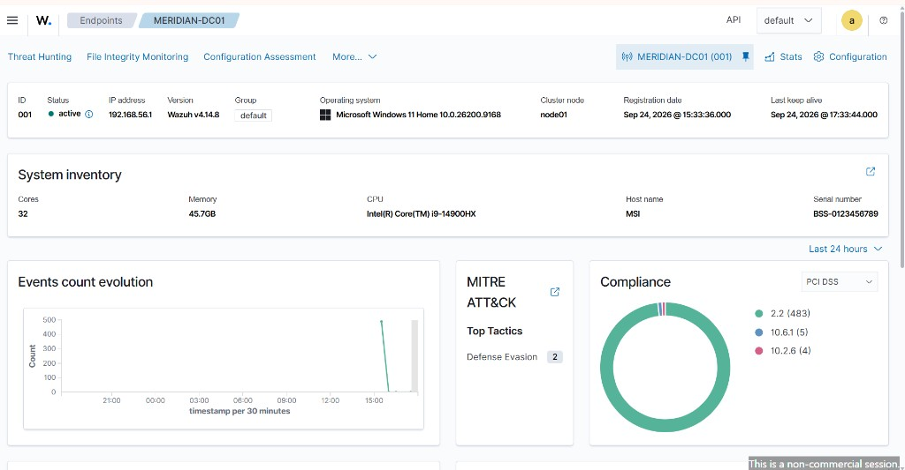

#### Evidence 3 — Both agents

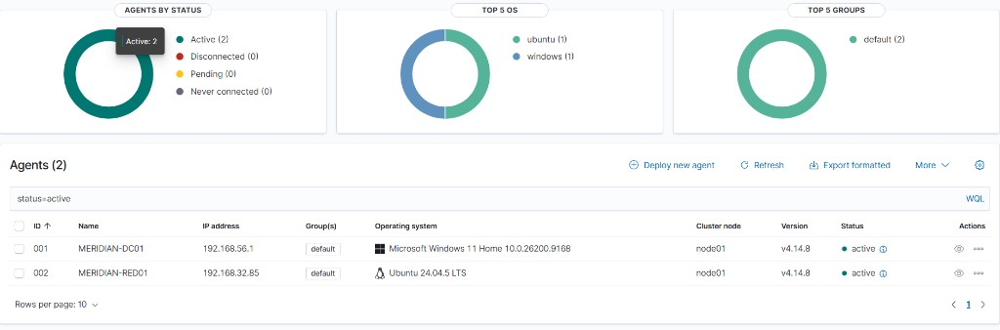

#### Evidence 4 — SSHD failed

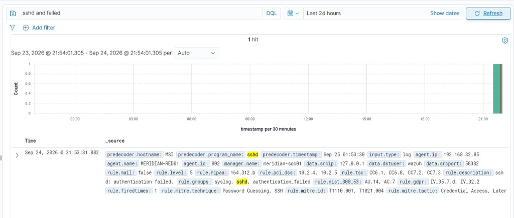

#### Evidence 5 — Custom rule 100020

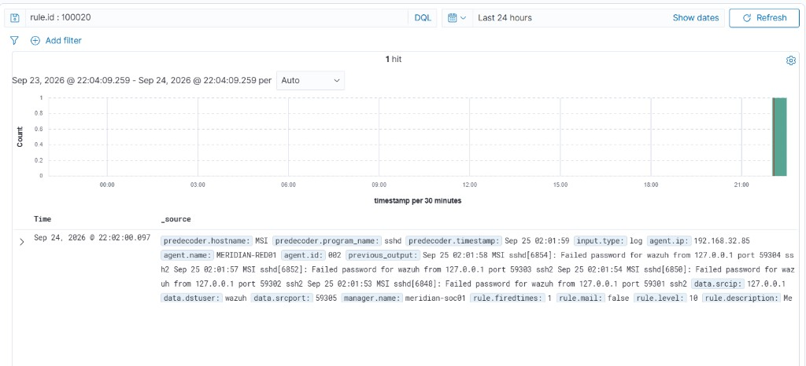

#### Evidence 6 — Rule 5760

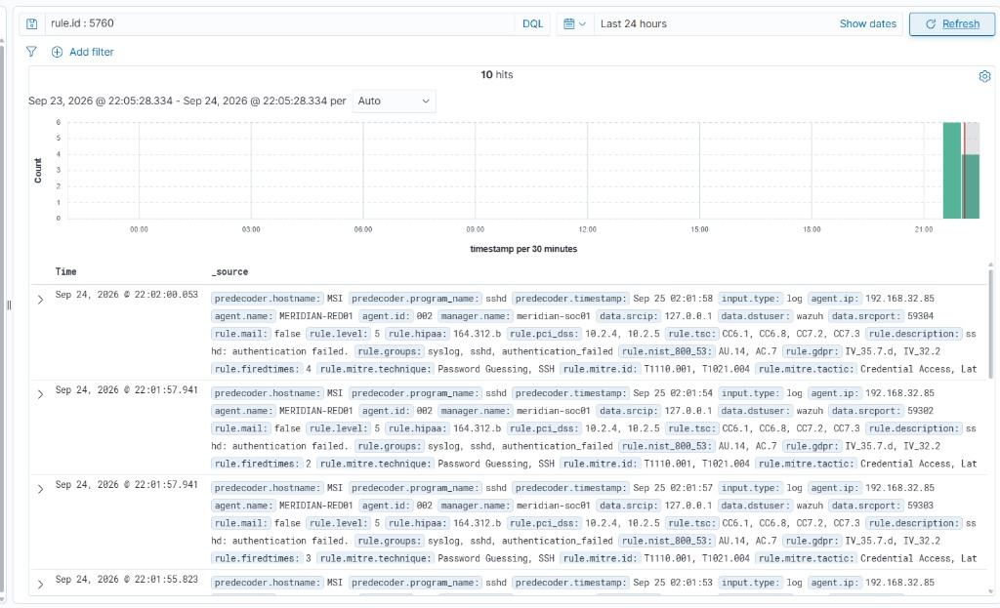

#### Evidence 7 — Retry success path

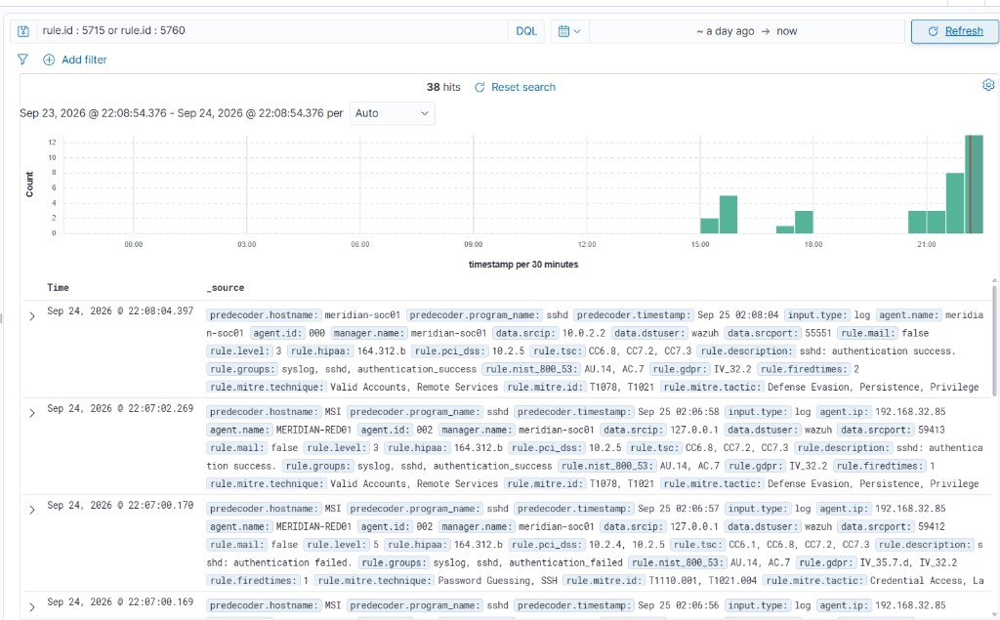

#### Evidence 8 — 100020 burst

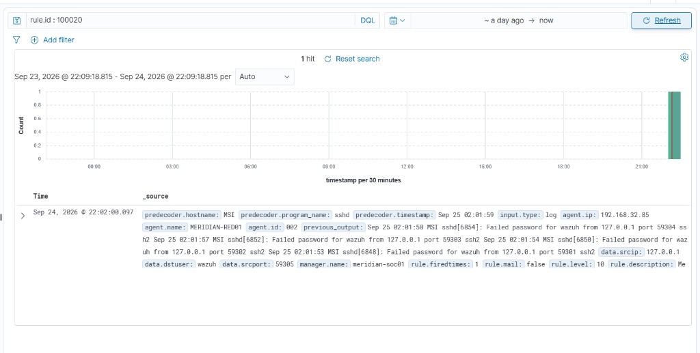

---

## Safety / ethics

Disposable classroom lab only. No production domains, no credential reuse outside VirtualBox `meridian-lab-net`. Do not commit live Wazuh client keys or host admin password dumps (`DC01_CREDENTIALS.txt` is gitignored).

## Rebuild Lab 4.1 PDF

```powershell
cd 4.1/submission
pdflatex -interaction=nonstopmode Ali_Week04_Module01_Lab.tex
```

Figures must live at `evidence/figures/fig_ev*.png` relative to the `.tex` file.
